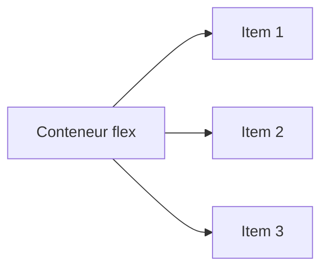

<!--
  📘 GUIDE ANIMÉ — FLEXBOX
  Ce fichier utilise du HTML + CSS intégré pour créer des démonstrations ANIMÉES.
  ⚠️ Rendu : les animations fonctionnent dans VS Code (Markdown Preview),
  Obsidian, Typora, ou un navigateur (via un convertisseur .md → .html).
  GitHub.com filtre les balises <style> par sécurité : sur GitHub, seuls les
  schémas statiques + le code s'afficheront correctement. Pour la version
  animée en cours, ouvre-le en Aperçu (Preview) dans VS Code (Ctrl+Shift+V).
-->

<div align="center">

# 🎨 FLEXBOX — Le Guide Animé
### Comprendre le Flexbox en le voyant bouger


</div>

---

## 🧠 1. C'est quoi Flexbox ?

Flexbox (**Flexible Box Layout**) est un modèle CSS pour aligner et distribuer
des éléments dans un conteneur, même quand leur taille est inconnue ou dynamique.

**Deux acteurs :**
- 📦 **Le conteneur flex** (`display: flex`) → le parent
- 🧱 **Les éléments flex** (`flex-items`) → les enfants directs

```css
.container {
  display: flex;
}
```

<div align="center">



</div>

---

## 🎬 2. Démo animée — `flex-direction`

<div>
<style>
.demo1-box {
  display: flex;
  gap: 8px;
  background: #1e293b;
  padding: 16px;
  border-radius: 12px;
  animation: direction-cycle 8s infinite;
}
.demo1-box div {
  width: 50px; height: 50px;
  background: linear-gradient(135deg,#38bdf8,#818cf8);
  border-radius: 8px;
  display:flex; align-items:center; justify-content:center;
  color:white; font-weight:bold;
}
@keyframes direction-cycle {
  0%, 20%   { flex-direction: row; }
  25%, 45%  { flex-direction: row-reverse; }
  50%, 70%  { flex-direction: column; }
  75%, 95%  { flex-direction: column-reverse; }
  100%      { flex-direction: row; }
}
</style>
<div class="demo1-box">
  <div>1</div><div>2</div><div>3</div>
</div>
</div>

👀 **Regarde** : le conteneur passe automatiquement par
`row` → `row-reverse` → `column` → `column-reverse`.

```css
.container {
  display: flex;
  flex-direction: row; /* row | row-reverse | column | column-reverse */
}
```

---

## 🎬 3. Démo animée — `justify-content`

<div>
<style>
.demo2-box {
  display: flex;
  gap: 8px;
  background: #1e293b;
  padding: 16px;
  border-radius: 12px;
  animation: justify-cycle 10s infinite;
}
.demo2-box div {
  width: 40px; height: 40px;
  background: linear-gradient(135deg,#f472b6,#fb923c);
  border-radius: 8px;
}
@keyframes justify-cycle {
  0%, 15%   { justify-content: flex-start; }
  20%, 35%  { justify-content: center; }
  40%, 55%  { justify-content: flex-end; }
  60%, 75%  { justify-content: space-between; }
  80%, 95%  { justify-content: space-around; }
  100%      { justify-content: flex-start; }
}
</style>
<div class="demo2-box">
  <div></div><div></div><div></div>
</div>
</div>

👀 **Ordre observé** : `flex-start` → `center` → `flex-end` →
`space-between` → `space-around`.

```css
.container {
  display: flex;
  justify-content: flex-start;
  /* flex-start | center | flex-end | space-between | space-around | space-evenly */
}
```

---

## 🎬 4. Démo animée — `align-items`

<div>
<style>
.demo3-box {
  display: flex;
  gap: 8px;
  height: 140px;
  background: #1e293b;
  padding: 16px;
  border-radius: 12px;
  animation: align-cycle 8s infinite;
}
.demo3-box div {
  width: 40px; height: 40px;
  background: linear-gradient(135deg,#34d399,#22d3ee);
  border-radius: 8px;
}
@keyframes align-cycle {
  0%, 20%   { align-items: flex-start; }
  25%, 45%  { align-items: center; }
  50%, 70%  { align-items: flex-end; }
  75%, 95%  { align-items: stretch; }
  100%      { align-items: flex-start; }
}
</style>
<div class="demo3-box">
  <div></div><div></div><div></div>
</div>
</div>

```css
.container {
  display: flex;
  align-items: flex-start;
  /* flex-start | center | flex-end | stretch | baseline */
}
```

---

## 🎬 5. Démo animée — `flex-wrap`

<div>
<style>
.demo4-box {
  display: flex;
  gap: 6px;
  width: 220px;
  background: #1e293b;
  padding: 16px;
  border-radius: 12px;
  animation: wrap-cycle 6s infinite;
}
.demo4-box div {
  width: 50px; height: 50px;
  flex-shrink: 0;
  background: linear-gradient(135deg,#fbbf24,#ef4444);
  border-radius: 8px;
}
@keyframes wrap-cycle {
  0%, 45%   { flex-wrap: nowrap; }
  50%, 95%  { flex-wrap: wrap; }
  100%      { flex-wrap: nowrap; }
}
</style>
<div class="demo4-box">
  <div></div><div></div><div></div><div></div><div></div>
</div>
</div>

👀 5 boîtes de 50px dans un conteneur de 220px : en `nowrap` elles débordent,
en `wrap` elles passent à la ligne.

```css
.container {
  display: flex;
  flex-wrap: nowrap; /* nowrap | wrap | wrap-reverse */
}
```

---

## 🎬 6. Démo animée — `flex-grow` / `flex-shrink`

<div>
<style>
.demo5-box {
  display: flex;
  gap: 8px;
  background: #1e293b;
  padding: 16px;
  border-radius: 12px;
}
.demo5-box .grow-item {
  height: 50px;
  background: linear-gradient(135deg,#a78bfa,#f472b6);
  border-radius: 8px;
  animation: grow-cycle 6s infinite;
}
@keyframes grow-cycle {
  0%, 30%  { flex-grow: 0; width: 60px; }
  50%, 80% { flex-grow: 1; width: auto; }
  100%     { flex-grow: 0; width: 60px; }
}
</style>
<div class="demo5-box">
  <div class="grow-item"></div>
  <div style="width:60px;height:50px;background:#475569;border-radius:8px;"></div>
</div>
</div>

👀 L'élément coloré passe de `flex-grow: 0` à `flex-grow: 1` :
il **grandit pour occuper l'espace libre**.

```css
.item {
  flex-grow: 0;    /* ne grandit pas (par défaut) */
  flex-shrink: 1;  /* peut réduire si besoin (par défaut) */
  flex-basis: auto;/* taille de départ */
}
/* raccourci */
.item { flex: 0 1 auto; }
```

---

## 🎬 7. Démo animée — `gap`

<div>
<style>
.demo6-box {
  display: flex;
  background: #1e293b;
  padding: 16px;
  border-radius: 12px;
  animation: gap-cycle 4s infinite;
}
.demo6-box div {
  width: 50px; height: 50px;
  background: linear-gradient(135deg,#60a5fa,#34d399);
  border-radius: 8px;
}
@keyframes gap-cycle {
  0%, 40%  { gap: 0px; }
  60%, 100% { gap: 24px; }
}
</style>
<div class="demo6-box">
  <div></div><div></div><div></div>
</div>
</div>

```css
.container {
  display: flex;
  gap: 16px; /* espace entre les items, sans marges manuelles */
}
```

---

## 📝 8. Aide-mémoire (cheat sheet)

| Propriété | S'applique sur | Valeurs clés |
|---|---|---|
| `display` | conteneur | `flex`, `inline-flex` |
| `flex-direction` | conteneur | `row`, `row-reverse`, `column`, `column-reverse` |
| `justify-content` | conteneur | `flex-start`, `center`, `flex-end`, `space-between`, `space-around`, `space-evenly` |
| `align-items` | conteneur | `flex-start`, `center`, `flex-end`, `stretch`, `baseline` |
| `flex-wrap` | conteneur | `nowrap`, `wrap`, `wrap-reverse` |
| `gap` | conteneur | `<valeur>px` |
| `flex-grow` | item | `0`, `1`, `2`... |
| `flex-shrink` | item | `0`, `1`... |
| `flex-basis` | item | `auto`, `<valeur>px` |
| `align-self` | item | remplace `align-items` pour un seul item |

---

## ✏️ 9. Exercices pour les étudiants

1. Crée une barre de navigation avec un logo à gauche et 3 liens à droite
   (`justify-content: space-between`).
2. Centre parfaitement une carte au milieu de l'écran
   (`justify-content: center; align-items: center;` sur `body` ou un wrapper).
3. Fais une galerie d'images qui passe à la ligne automatiquement
   (`flex-wrap: wrap` + `gap`).
4. Fabrique 3 colonnes égales qui grandissent ensemble
   (`flex: 1` sur chaque colonne).
5. **Défi** : reproduis une des animations ci-dessus toi-même,
   avec tes propres couleurs et timings.

---

<div align="center">

💡 **Astuce prof** : ouvre ce fichier dans VS Code et fais `Ctrl+Shift+V`
pour voir toutes les animations en direct pendant le cours.

 **LingoLab Academy -- dr chikh amine**

</div>